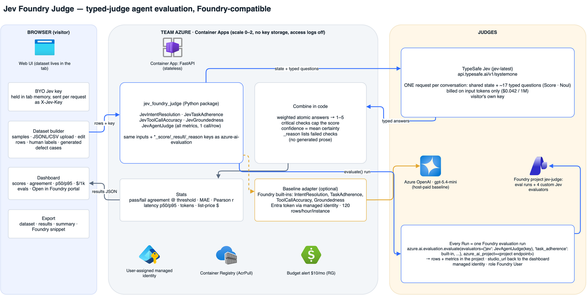
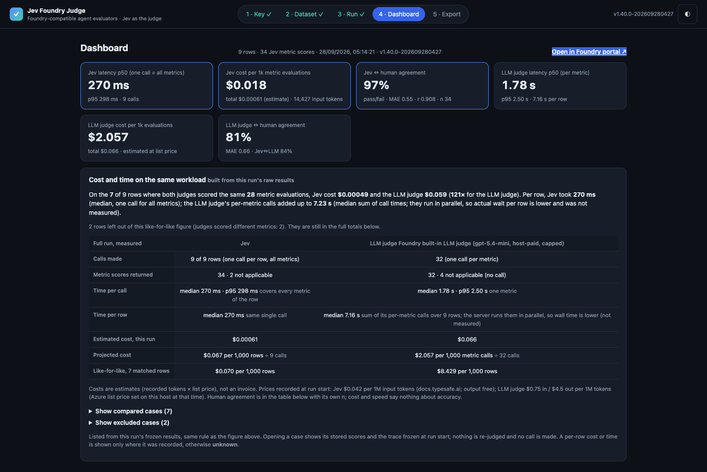
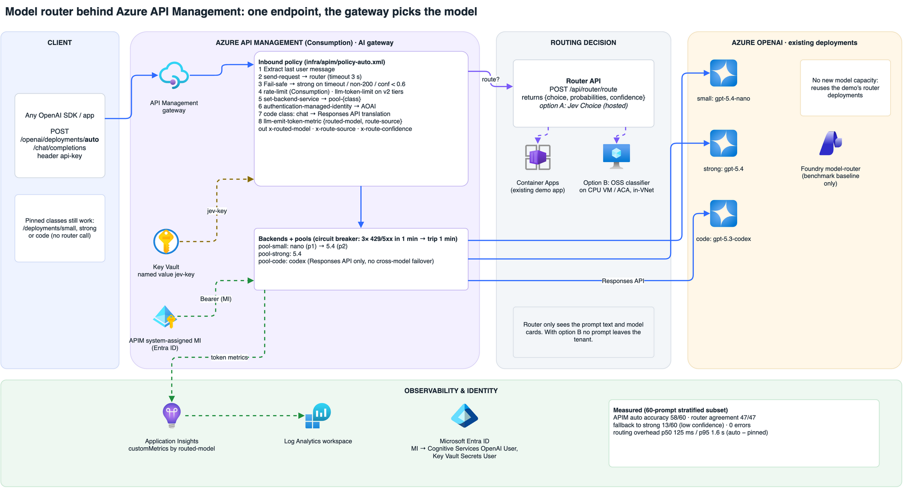

# Jev Foundry Judge

**Use [TypeSafe Jev](https://docs.typesafe.ai) as the judge for Azure AI Foundry agent evaluation.**
Four drop-in evaluators match the Foundry built-ins: Intent Resolution, Task Adherence, Tool Call Accuracy and Groundedness. Each one splits its metric into small typed questions, and all of them are answered in **one Jev call per conversation**. Plain code combines the answers into a 1–5 score. Every verdict lists the checks that drove it.

A demo web app is included. Paste your own Jev key, build or upload an eval dataset, then run Jev next to Foundry's own LLM-judge evaluators. The app measures latency, cost and agreement with human labels. **Every run goes through `azure.ai.evaluation.evaluate(..., azure_ai_project=...)`, so the results appear in the demo's Foundry project.** The dashboard links straight to the run with an "Open in Foundry portal" button.





> Demo video (silent, captioned, 77 s, recorded on the live app v1.40.0): [`demo/jev-foundry-judge-demo-silent.mp4`](demo/jev-foundry-judge-demo-silent.mp4), captions also in `demo/jev-foundry-judge-demo-silent.vtt`. To add narration in your own voice, record the lines in `demo/narration-script.md` and run `python demo/make_voiceover.py --recordings <dir>`.

## Model router (home page)

The same System One pattern powers a **model router**. You describe each model in one line (small and cheap, strong reasoning, code). Jev answers one **Choice** question per prompt and returns a probability for each model. A small policy then decides: take the most likely model, or the cheapest model above a threshold, and fall back to the strong model when confidence is low. The API is `POST /api/router/route`, which takes prompts and model cards and returns the choice, probabilities and confidence.

**Benchmark** (240 frozen public prompts from MMLU, GSM8K, HumanEval, MBPP and Dolly, 80 per class, one live run on 2026-09-29):

| Router | Accuracy | Saving vs always-strong | p50 latency | $ / 1k routes |
|---|---|---|---|---|
| Jev | 86% | 46% | 279 ms | $0.023 |
| Jev + fallback (conf < 0.6 → strong) | **94%** | 37% | 279 ms | $0.023 |
| LLM router (gpt-5.4-mini) | 80% | 51% | 1.5 s | $0.475 |
| Embedding similarity | 53% | 19% | 446 ms | $0.0014 |

- Savings are list-price estimates.
- Labels come from a task-type rubric.
- Raw data is in `benchmark/router/`.
- Any classifier with the same interface can replace Jev, including a self-hosted open-source non-autoregressive model on a CPU VM or Container App.

### Behind Azure API Management



A live Consumption-tier APIM exposes one `auto` deployment:

- It routes each request through `/api/router/route` and falls back to the strong model on timeout, error or low confidence.
- It uses per-class backend pools with circuit breakers and a managed identity to Azure OpenAI.
- The Jev key comes from Key Vault.
- Token metrics are split by routed model.

On a 60-prompt stratified subset it routed 58/60 correctly, with a p50 routing overhead of 125 ms. See [`docs/apim-router.md`](docs/apim-router.md) and [`infra/apim/`](infra/apim/).

## Self-host with open-weight models (no API key, data stays in your tenant)

The judge and router make one `POST /v1/systemone` call. Open-weight decision models expose the same API, so you can swap Jev for a model on your own Azure VM by setting `JEV_URL` and `JEV_MODEL`. [`selfhost/`](selfhost/) has the server, a one-command VM deployment and the full results. Measured on a 16-vCPU CPU VM with no GPU:

| | Jev (API) | Clef-flash (self-hosted, CPU) | Built-in LLM |
|---|---|---|---|
| Router accuracy, 240 prompts | 86% (94% with fallback) | **95%** | 80% |
| Router p50 latency | 279 ms | 2.3 s | 1.5 s |
| Judge agreement with humans, 47 conversations | 86% | **82%** | 72% |
| Judge p50 per conversation | 0.3 s | 16.7 s | ~6.4 s |

Clef-flash matches Jev on routing accuracy, and it comes close on judging. On CPU it is slower and costs more per call than the Jev API, so use it when data residency matters more than speed, or add a GPU. CLM-8B was also tested and routed only 46% correctly.

## Why this pattern

An LLM judge writes an essay and then a number. That makes it slow, token-heavy, and hard to audit or calibrate. Jev is a *System One* model: you give it a state and typed questions (**Score**, **Noul** yes/no, **Choice**), and it returns calibrated probabilities. You pay only for input tokens.

That lets you:

1. **Decompose.** For example, Task Adherence becomes: an overall 5-level Score, "broke a system rule?", "went out of scope?", "asserted unverified account specifics?" and "did the required steps?".
2. **Fan out.** All four metrics' questions (about 17) share one state and go in one request.
3. **Combine in code.** Weights are public. *Critical* checks (e.g. "broke a system rule" with p > 0.8) cap the score at 2. Confidence is the mean certainty of the atomic answers.
4. **Explain without prose.** `*_reason` lists the checks that failed, and `*_properties.checks` holds every atomic answer.

## Measured benchmark (live calls, 2026-09-26)

47 agent conversations: 21 hand-written synthetic traces across 3 scenarios, plus 26 generated defect cases. Every row carries human labels. Four metrics were scored where applicable. Both judges were called live through the deployed app from Singapore (Azure southeastasia).

| | **Jev** (`jev-1.13.0`) | **Foundry built-in LLM judge** (`gpt-5.4-mini`) |
|---|---|---|
| Latency p50 / p95 | **296 / 385 ms per conversation** (all 4 metrics, 1 call) | 1.95 / 3.05 s **per metric** (≈ 6.4 s per conversation, sequential) |
| Cost per 1k metric evaluations | **$0.017** | $1.97 (list price, input $0.75 / output $4.50 per 1M tokens) |
| Pass/fail agreement with human labels (threshold 3), each judge's own scores (Jev n = 164, LLM n = 155) | **86 %** | 72 % |
| Mean abs. error vs human (1–5) | **0.66** | 1.24 |
| Pearson r vs human | **0.84** | 0.49 |

Per metric, pass/fail agreement with human labels (Jev vs LLM judge): Intent Resolution 92 % vs 77 %, Task Adherence 70 % vs 60 %, Tool Call Accuracy 87 % (n = 32) vs 83 % (n = 23), Groundedness 97 % vs 76 %. Overall agreement uses each judge's own scores (Jev n = 164, LLM n = 155): Jev also scored 9 Tool Call Accuracy rows the LLM judge skipped. MAE and Pearson r in the table are over each judge's own scores (Jev n = 164, LLM n = 155). An earlier full run on v1.0.1 gave 89 % vs 77 % overall, so expect a few points of run-to-run variation. Raw data is in `benchmark/results/`: `dataset.jsonl`, `results.jsonl` and `summary.json`.

**Same workload.** Cost per metric evaluation is not quite like-for-like, because on 9 conversations only Jev scored Tool Call Accuracy. Restricted to the 38 of 47 conversations where both judges scored exactly the same metrics (137 metric evaluations each), Jev cost $0.00232 and the LLM judge $0.273: **118×**, or $0.061 vs $7.19 per 1,000 conversations. The app's Dashboard and benchmark brief compute this same-workload figure for every run.

**Read these numbers honestly.** 47 conversations is a small, synthetic set. The human labels were written by the dataset author, who also planted the defects, so they are not independent annotators. Treat the table as a reproducible method and a first signal, not a leaderboard. The app exists so you can repeat it on **your own** traces with your own labels.

### Benchmark method
- **Dataset:** `samples/make_samples.py` produces fictional Northwind (support + tools), Fabrikam (RAG over a travel policy) and Tailspin (flight booking) traces in the Foundry agent message format. Each good row feeds `mutations.py`, which injects exactly one known defect: drop tool calls, corrupt a tool argument, append an unsupported claim, or replace the answer with an off-topic upsell. The expected label for that defect is set to 1–2.
- **Jev:** `JevAgentJudge`, one request per row, `jev-latest`. Latency is the wall-clock time of the HTTPS call from the app container. Cost is `input_tokens × $0.042/1M` (docs.typesafe.ai/models; output tokens are free).
- **Baseline:** `azure-ai-evaluation==1.18.7` `IntentResolutionEvaluator`, `TaskAdherenceEvaluator`, `ToolCallAccuracyEvaluator` and `GroundednessEvaluator`, with `is_reasoning_model=True`. It runs on a dedicated `gpt-5.4-mini` GlobalStandard deployment through managed identity. Cost is taken from each evaluator's reported prompt and completion tokens at Azure retail list price. The SDK's Task Adherence is binary, so it maps to 1 (fail) or 5 (pass).
- **Agreement:** pass/fail at threshold 3, MAE and Pearson r on the 1–5 scale. Metrics without the needed inputs are `not_applicable` and excluded (e.g. tool accuracy without tools, groundedness without evidence).
- To reproduce: `JEV_API_KEY=… python scripts/benchmark.py <app-url> <out-dir>`.

## Use the evaluators in Foundry

```bash
pip install "jev-foundry-judge[foundry] @ git+https://github.com/nguyennhianhtri/jev-foundry-judge"
```

```python
import os
from azure.ai.evaluation import evaluate
from jev_foundry_judge import (JevIntentResolutionEvaluator, JevTaskAdherenceEvaluator,
                               JevToolCallAccuracyEvaluator, JevGroundednessEvaluator)

key = os.environ["JEV_API_KEY"]
result = evaluate(
    data="dataset.jsonl",  # Foundry agent format: query, response, tool_definitions, context
    evaluators={
        "jev_intent": JevIntentResolutionEvaluator(key),
        "jev_adherence": JevTaskAdherenceEvaluator(key),
        "jev_tools": JevToolCallAccuracyEvaluator(key),
        "jev_grounded": JevGroundednessEvaluator(key),
    },
    evaluator_config={"default": {"column_mapping": {
        "query": "${data.query}", "response": "${data.response}",
        "tool_definitions": "${data.tool_definitions}", "context": "${data.context}"}}},
    azure_ai_project="https://<resource>.services.ai.azure.com/api/projects/<project>",
)
print(result["studio_url"])  # opens the run, per-row outputs and metrics in the Foundry portal
```

Your identity needs the **Foundry User** role (formerly Azure AI User) on the Foundry resource. Pass `credential=` if `DefaultAzureCredential` would pick the wrong one.

### Register the evaluators in your project
`scripts/register_evaluators.py <project-endpoint>` registers the four Jev evaluators as **custom code-based evaluators** in the project's evaluator catalog (Foundry Evaluators API `POST /evaluators/{name}/versions`, `api-version=v1`, preview feature `Evaluations=V1Preview`; same call as `azure-ai-projects` `beta.evaluators.create_version`). They show up as `jev_intent_resolution`, `jev_task_adherence`, `jev_tool_call_accuracy` and `jev_groundedness`, with the Jev key as a required init parameter. No key is stored in the evaluator. This part of the API is in preview.

Each evaluator returns the built-in key family, `task_adherence`, `task_adherence_score`, `_result`, `_passed`, `_threshold` and `_reason`, plus `_confidence` and `_properties`. The properties carry the atomic checks, tokens, latency and USD. `JevAgentJudge` scores all four metrics in one call.

## Run the demo app

```bash
pip install -r requirements.txt            # + requirements-baseline.txt for the LLM-judge column
PYTHONPATH=src uvicorn main:app --app-dir app --port 8080
# optional baseline (Entra auth, no keys):
#   AOAI_ENDPOINT=https://<aoai>.openai.azure.com/ AOAI_DEPLOYMENT=<gpt-5.4-mini deployment>
# optional Foundry logging (Entra auth): every Run becomes a Foundry evaluation run
#   FOUNDRY_PROJECT_ENDPOINT=https://<resource>.services.ai.azure.com/api/projects/<project>
```

The journey has five steps: **Key → Dataset** (**+ Add case**: type one real example — case ID, user request, assistant answer, optional grounding context and optional 1–5 labels — in a plain form, no JSON; it is validated before Add, refuses duplicate IDs, is tagged *user-authored* and adds no tool calls, context or labels you didn't type; **Edit** reopens that same form for any simple text case to correct the request, answer, context or labels — exact text prefilled, other fields and provenance kept, duplicate IDs refused, Cancel changes nothing; rich tool/multi-message traces stay in the ✎ JSON editor so they are never flattened; your previous run stays frozen and inspectable and the app tells you to run again to score the edits; **Variant** makes a contrast case: a new row right after the source, with its ID suggested, so you can change the answer and judge the original and the variant side by side. The source is never changed. The variant's labels start blank because copied labels describe the source answer. It is tagged *user-authored* with a `derived_from` link to its source, not claimed as an observed agent run. Duplicate, identical, invalid or stale saves add nothing. Rich tool traces are deep-copied into the JSON editor and never flattened; samples, JSONL/CSV upload, OpenAI chat-trace import, inline label editing, generated defect cases; a **Human-label coverage per metric** panel shows, before you run, how many rows each metric can actually use for human agreement — labelled / applicable under the Jev judge's own applicability rule (Tool Call Accuracy needs a tool call or tool list, Groundedness needs context or a tool result), not-applicable rows, invalid labels such as 0, and the exact case IDs that still need a label (click one to jump to that row's label or JSON editor; **show all** lists every ID, and **Review N missing labels →** steps through each one for the chosen metric: remaining / applicable and the exact case ID, the original row's label box — or the ✎ JSON editor with the reason for an invalid label — and it moves only when you press **Next needing a label**, re-checking the current draft each time, telling you when a row was deleted, and stopping when none remain; only labels you type are saved; to label a whole case at once, press a row's **Labels** button or **Label cases one at a time (all metrics) →**: one dialog shows the exact case ID and the original case as stored, every metric's current label or blank, and n/a with the judge's reason; an invalid stored label goes to the ✎ JSON editor; you save only what you typed, **Save & next case needing labels** moves on only when pressed, and a row changed or removed while it is open is refused; keyboard: in a label box, 1–5 sets that metric and moves to the next applicable one (never saves), Enter = Save & next, Tab/Shift+Tab/Esc work as usual; a progress strip shows how many cases you have relabelled this session (a save that changes nothing, or one you undo, does not count) and how many cases still need an applicable label, and **Undo last save** puts back exactly the labels the most recent case had before that save, including labels that were blank. It is refused, and nothing is changed, if that case was edited, deleted or replaced since. **Preview label changes** lists the cases whose saved labels differ from before their first label-pass save this session, as metric before → after (blank stays blank, not 0), and **Download label changes (.json)** saves that list to your device for a reviewer: case ID, row position, metric, before and after. Saves that changed nothing, undone saves and changes set back to the original are left out; cases deleted, re-imported or replaced since are left out rather than attributed to another row. It covers this browser session only; it is not an audit history, and it holds no traces, keys, scores or agreement. **Review label-changes file** opens such a download as a checklist on your device: it checks the file first, then counts entries that match the current label, differ now, are missing (no case with that exact ID), are ambiguous (several cases share the ID) or are invalid, before you step through anything. The file's before → after values are shown for comparison only and are never applied. Cases are matched by exact ID, never by row position, and because the file holds labels rather than traces it cannot prove the matched case is unchanged, so the dialog shows the trace. **Open in label dialog** allows only that entry's metric to be edited, and a label changes only if you type one and Save. Import, **Next** and **Skip** change nothing, and a bad, empty or duplicate-entry file is refused. **Confirm current label** records that you checked an entry and its current label is right, without changing it. **Download checklist outcome (.json)** saves, for each entry, the exact case ID and metric, the file's before → after, the label now, and its current status (match, differs, missing, ambiguous or invalid). It also records what you actually did, which is kept separate from the status: *saved* (a typed Save, with a flag for whether it changed the label), *confirmed*, *skipped* or *not reviewed*. Opening an entry, Next, and a label that happens to match the file are never counted as confirmation. If a case is edited, deleted or replaced after you acted on it, that evidence is marked *stale*. Importing another file starts a fresh outcome. No traces, keys or scores are included. A second reviewer can open that download with **Inspect checklist outcome**, which is read-only. It checks the file first: kind, version and shape, and the stated counts must equal the entries, so a bad, oversized or inconsistent file is refused and nothing changes. The view keeps two things apart. **Claimed in file** shows what the earlier reviewer's browser says was saved, confirmed, skipped or not reviewed, with each entry's status and label at their export. **Checked now** re-matches every entry against your current dataset by exact ID and metric (an ambiguous ID is refused, blank is not a number) and shows whether the label they saved or confirmed is the same now, different now, or cannot be checked. The file is not signed and has no reviewer identity or trace fingerprint, so a label that matches now does not prove their review still holds. Nothing is applied, uploaded or overwritten, and your dataset, frozen run, own checklist and unsaved label drafts are left as they were. **Open current case** on an entry that still matches exactly one case (same ID and type) shows, read-only, that case as it is in your dataset now: the full stored trace (request, conversation, answer, tool calls and results, context) and the current label and applicability for that metric, next to what the file claims. It is re-matched when you click, so a deleted, duplicated or retyped ID is refused and never opens another row. If the case is edited or deleted while it is open, the view says it is no longer current. It is today's dataset, not proof of the trace they reviewed, and opening it is not a review: nothing is saved, confirmed or sent. **Back** returns to the same entry. Each Save or Confirm in the checklist also records a **trace fingerprint** at that moment: a SHA-256 (scheme `jfj-trace-v1`) of every stored field of the case except its labels, with object keys sorted and message/tool order kept, computed in your browser. The downloaded outcome holds only that digest, never the trace. When a second reviewer inspects the file, each entry shows, apart from the label comparison, whether the one current case with that exact ID hashes the same (**trace same as at their action**) or not (**trace CHANGED**), so an unchanged label on a changed answer, tool call or context is visible, while relabelling alone or reordered JSON keys are not counted as a change. Older files without a fingerprint show *no fingerprint*, never *same*; malformed or unsupported fingerprints are said to be so. It is an unsigned content comparison: not reviewer identity, not proof the label is right, and it cannot show which field changed.); after a run it also shows the frozen run's coverage, which later edits never change; counts only, nothing is scored or labelled for you) **→ Run** (one `evaluate()` call logged to the Foundry project, with the Jev judge and the built-in evaluators side by side) **→ Dashboard** (an **Open in Foundry portal** link to the run, per-metric means, agreement matrix, p50/p95, $/1k, and a **disagreement review**: filter to the exact Jev↔human or Jev↔LLM pass/fail disagreements, overall or per metric, with the comparable-pair and excluded counts spelled out; click a flagged score to see the stored score pair, Jev's atomic checks and the trace exactly as it was sent in that run; **Original vs variant pairs** (same filter): each Variant next to its exact source from the same frozen run, with Jev/LLM/human scores, signed variant − original change per judge on its 1–5 scale, missing = unknown, excluded pairs listed with the reason, and both traces side by side; no verdict is drawn from authored contrasts; **Download pair comparison (.json)** saves that same frozen-run projection to your device: source and variant IDs, stored original and variant scores and signed changes per judge and metric, per-metric denominators, excluded and unpaired rows with reasons, both frozen traces, Jev checks and authored provenance; missing stays null, edits after the run don't change it, and nothing is re-judged or uploaded; **Download disagreement review (.json)** saves that exact filter to your device as a case packet: threshold, counts, excluded reasons, each disagreeing pair with its stored scores, Jev checks, frozen trace and label source, built in the browser without re-judging) **→ Export** (dataset and results as JSONL/CSV, benchmark JSON, Foundry snippet).

### API metric selection
`POST /api/judge` and `POST /api/foundry-run` take an optional `metrics` field. Omit it (or send `null`) to score all four metrics. Otherwise send a non-empty list of exact IDs: `intent_resolution`, `task_adherence`, `tool_call_accuracy`, `groundedness`. Duplicates are dropped and results come back in that canonical order. An empty list, a non-list, a non-string entry or any unknown ID (case and spaces count, e.g. `"groundednes"` or `"Groundedness"`) returns `400` naming the bad IDs and the allowed ones, and nothing is run: no Jev, baseline or Foundry call is made. The app's own Run step only sends IDs from its checkboxes.

### Security posture
- The visitor's key is kept in page memory and sent as an `X-Jev-Key` header on their own requests only. It is not stored, logged or echoed, and the password field is cleared after connecting. Access logs are off, and no server-side Jev key exists, so nothing can fall back to one.
- The optional baseline uses the host's Azure OpenAI through a user-assigned managed identity, with local auth disabled on the account. It is capped at 25 rows per request and 120 baseline rows per hour per instance.
- Foundry logging uses the same managed identity (role **Foundry User** on the demo's Foundry resource). The run stores the dataset rows and per-row scores in the demo project, so upload only data you are happy to share with the host. The Jev key is never written to the run. A run takes at most 60 rows. If Foundry logging fails, the app falls back to direct scoring and says so in the run log.
- CSP `default-src 'self'`, `no-store`, `frame-ancestors 'none'`.

### Deploy (Azure Container Apps, scale to zero)
`Dockerfile` builds the app. Reference deployment: Container Apps consumption, min 0 and max 2 replicas, user-assigned identity with AcrPull, Cognitive Services OpenAI User and Foundry User (on an AIServices account with one project), and a resource-group budget alert. A budget alert is a notification, not a spend cap.

## Layout
```
src/jev_foundry_judge/   evaluators.py (metric specs + combine), jev_client.py, baseline.py, foundry_run.py (evaluate() → Foundry project), mutations.py, stats.py
app/                     FastAPI app + static UI (no build step)
samples/                 synthetic datasets + generator
scripts/                 benchmark.py (live), register_evaluators.py (Foundry custom evaluators), journey.js (browser journey + screen capture)
docs/                    architecture.drawio / .png (generator: make_diagram.py), screenshots
benchmark/results/       measured run: dataset.jsonl, results.jsonl, summary.json
demo/                    captioned demo cut, narration script, voiceover muxer
tests/                   offline tests (no network)
```

## Limits
- Jev 1.13 is text-only, and accuracy drifts as state grows (see TypeSafe's jaggedness notes). Very long traces should be trimmed or split.
- The atomic question wording and weights are a starting point. Calibrate them against your own labels; the app is built for exactly that loop.
- Logging to a visitor's *own* Foundry project is not offered in the hosted demo: it would need the visitor's Entra token on the host. Run the app locally with `FOUNDRY_PROJECT_ENDPOINT` set to your project (and `az login`) to log runs into your own project.
- Not affiliated with or endorsed by TypeSafe. Product names belong to their owners.

MIT licensed.
