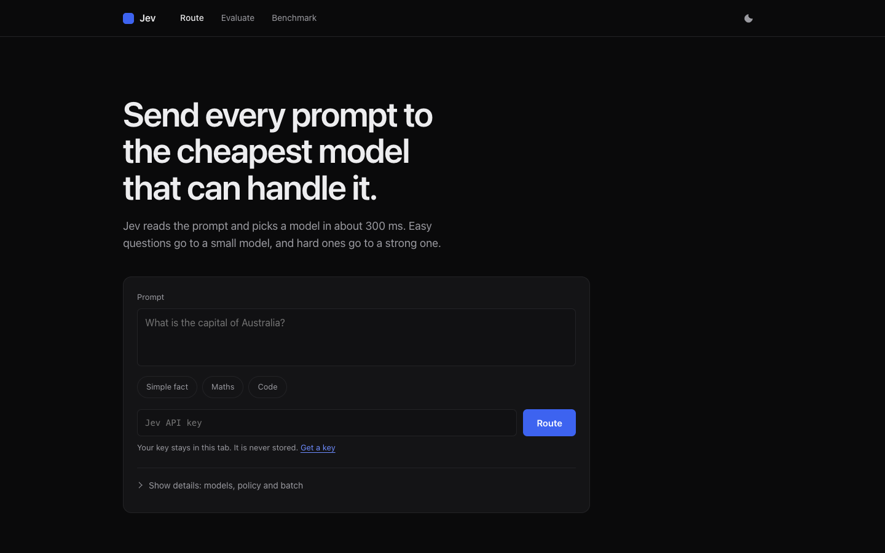
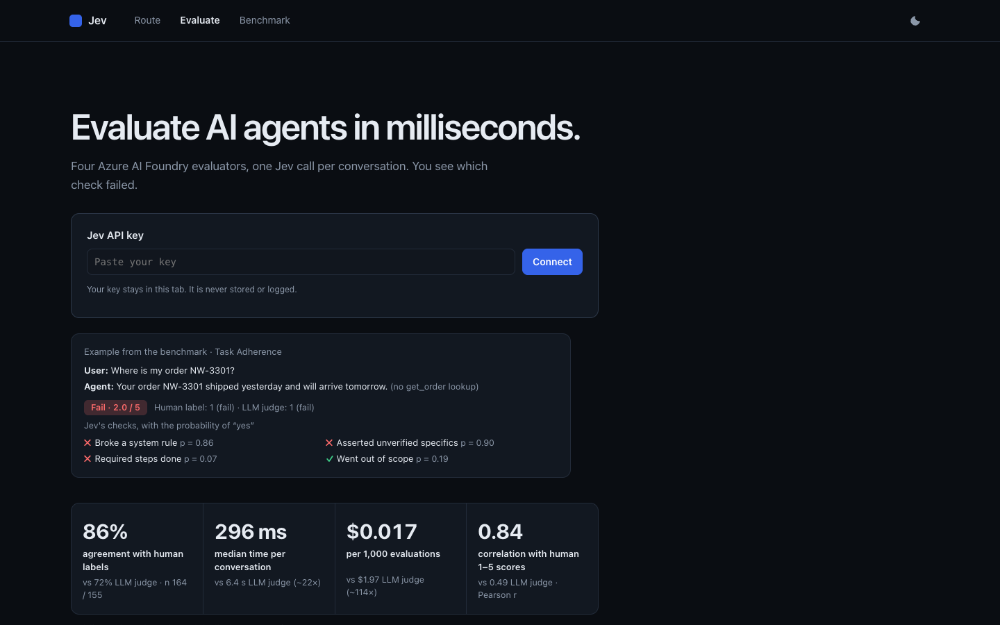
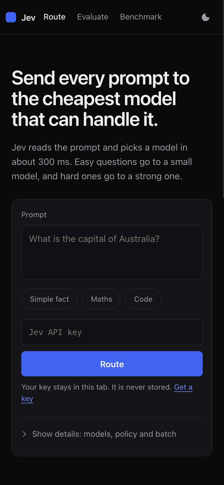

# Publish kit (drafts only, nothing has been posted)

The repo is private. These are drafts for T to review. Nothing here has been sent or published.

Figures come from `benchmark/router/results.json`, `benchmark/router/open-models/results.json`, `benchmark/results/summary.json` and `docs/apim-router.md`.

## Screenshots (captured from the live app, 2026-10-06)

| File | What it shows |
|---|---|
| `docs/screenshots/live-1-router.png` | Router home page with the 240-prompt benchmark table (desktop, 1440 px) |
| `docs/screenshots/live-2-evaluate.png` | Evaluate page: a Task Adherence fail with Jev's atomic checks and the headline numbers (desktop) |
| `docs/screenshots/live-3-router-phone.png` | Router on a phone (390 px) |

## Internal post (one message; attach live-1-router.png and live-2-evaluate.png)

> I've been testing TypeSafe's Jev, a small "System One" model that answers typed questions with probabilities instead of writing text, on two Foundry problems: model routing and agent evaluation.
>
> Routing: on 240 public prompts it picked the right model 86% of the time (94% with a fall-back-when-unsure rule) in about 280 ms, against 80% and 1.5 s for a gpt-5.4-mini router, at about 1/20th of the cost. It also runs behind APIM as one OpenAI-compatible `auto` deployment.
>
> Evaluation: four drop-in Foundry evaluators (Intent Resolution, Task Adherence, Tool Call Accuracy, Groundedness) agree with human labels 86% of the time vs 72% for the LLM judge, about 20x faster, and every verdict shows which check failed. Runs land in the Foundry project as normal evaluation runs.
>
> For customers who can't use an external API, an open-weight model self-hosted on a CPU VM routed 95%. We also tried CLM-8B and it only reached 37%, so not every open model works. Happy to demo. Repo and write-up on request.

## External blog draft (~600 words)

### Routing prompts and judging agents with one small model

Two problems come up in almost every Azure AI Foundry project I work on. The first is cost: teams send every prompt to their strongest model because nothing tells them which prompts a cheaper model could handle. The second is evaluation: the built-in LLM-judge evaluators are slow, costly at scale and hard to audit, because each verdict comes back as an essay followed by a number.

Both problems are classification problems, and an LLM is an expensive classifier. So I tried a different kind of model.

**A System One model.** TypeSafe's Jev does not generate text. You give it a state, such as a prompt or an agent conversation, plus typed questions: a yes/no question, a 1–5 score, or a choice between options. It returns a calibrated probability for each answer, and you pay only for input tokens. Plain code then turns the probabilities into a decision.

**Routing.** Each candidate model is described in one line: small and cheap, strong reasoning, or code. Jev answers one Choice question per prompt. A small policy takes the most likely model, or falls back to the strong model when confidence is below 0.6. I froze 240 public prompts from MMLU, GSM8K, HumanEval, MBPP and Dolly, 80 per class, and ran them once:

| Router | Correct model | Saving vs always-strong | p50 latency | $ per 1k routes |
|---|---|---|---|---|
| Jev | 86% | 46% | 279 ms | $0.023 |
| Jev + fallback | 94% | 37% | 279 ms | $0.023 |
| LLM router (gpt-5.4-mini) | 80% | 51% | 1.5 s | $0.475 |
| Embedding similarity | 53% | 19% | 446 ms | $0.0014 |

The savings are list-price estimates, and the labels come from a task-type rubric, so read them as directional. The pattern was clear, though. The fallback version gave up some saving to remove most wrong "small model" choices, which is the right trade for production.

**Behind API Management.** Applications should not have to know about any of this, so the router sits behind Azure API Management as one OpenAI-compatible deployment called `auto`. The policy calls the router and picks a backend pool. It uses circuit breakers and a managed identity to Azure OpenAI, and it falls back to the strong model on timeout, error or low confidence. Token metrics are split by routed model. On a 60-prompt sample it routed 58 correctly, adding about 125 ms at p50.

**Evaluation.** The same idea gives four drop-in Foundry evaluators. Task Adherence, for example, becomes a handful of small questions: did the agent break a system rule, go out of scope, assert account details it never looked up, and complete the required steps? All four metrics are answered in one Jev call per conversation. On 47 labelled conversations, Jev agreed with human pass/fail labels 86% of the time, compared with 72% for the LLM judge, at about 0.3 s per conversation compared with 6.4 s. Every run goes through `azure.ai.evaluation.evaluate()`, so the results show up in the Foundry project like any other evaluation. Each score lists the checks that drove it, which makes calibration against your own labels practical.

**Keeping data in your tenant.** Some customers cannot send prompts to an external API. The client only needs one endpoint, so an open-weight model with the same API can replace Jev. On a 16-vCPU CPU VM, Clef-flash routed 95% correctly and agreed with human labels 82% of the time. It was much slower at 2.3 s per route, and a GPU would fix that.

Not every open model works. I also self-hosted CLM-8B and verified its embeddings against the reference implementation. It routed only 37% correctly, 46% at best, which is close to guessing between three classes. I'm reporting that because a benchmark that only shows wins is not much use.

**What I'd take away.** Routing and judging are decisions, not writing tasks. A model built to return probabilities for typed questions is faster, cheaper and easier to audit than an LLM asked to do the same thing, and APIM lets you add it without changing application code. Measure it on your own prompts and labels before you trust any number here, including mine.

*Not affiliated with or endorsed by TypeSafe.*
