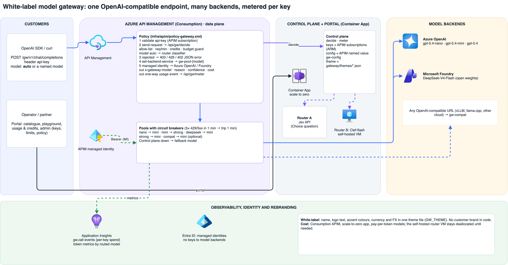

# Model Gateway: a white-label AI gateway on Azure API Management

One OpenAI-compatible endpoint for every model you run. Callers send `model: "auto"` and the gateway picks the cheapest model that can do the job, or they name a model. Every key has its own allow-list, rate limit and prepaid credits. The portal is white-label: switching one theme file rebrands it for a partner.

It is built for telcos, system integrators and enterprises that want to resell or run "AI as a service" in-region. The pattern is similar to a hosted model platform such as Fireworks AI, but it runs on your own Azure subscription.



Editable diagram: [`docs/gateway-architecture.drawio`](../docs/gateway-architecture.drawio) (generator: `docs/make_gateway_diagram.py`).

## What you get

| Page | What it shows |
|---|---|
| Model catalogue | Every backend with provider, price in/out per 1M tokens, region and data-residency badge, and live status. The two router classifiers are listed too (Jev API and the self-hosted open-weight model). |
| Playground | System message, temperature and a model picker that includes **Auto-routed**. Each reply shows the routed model, the route reason and confidence, prompt/completion tokens, latency and cost. |
| Usage & credits | Prepaid credits, spend and balance per key, calls by model and the most recent calls. Metered by the gateway and stored in Application Insights. |
| Admin | Create and revoke API keys (APIM subscriptions), with a per-key model allow-list, requests per minute and credits. Set the routing policy: classifier (Jev API or self-hosted), cheapest-model-above-probability threshold, confidence fallback, fallback model and budget guard. |

## How a call flows

1. The client calls `POST {apim}/gw/v1/chat/completions` with the key in the `api-key` header.
2. APIM checks the key (it is an APIM subscription) and calls the control plane's `/api/gw/decide`.
3. `decide` rejects a disallowed model (403), a key over its requests per minute (429) or a key with no credits left (402). For `model: auto` it asks the router classifier for a probability per allowed model and applies the policy: the cheapest model above the probability threshold, with a fallback model when confidence is low or the classifier is unavailable. When a key has spent more than the budget-guard percentage of its credits, `auto` uses the cheapest allowed model.
4. APIM forwards the call to that model's backend pool with its managed identity. Each pool has a circuit breaker and a priority-2 failover model.
5. On the way out APIM adds `x-gateway-model`, `x-gateway-reason`, `x-gateway-confidence`, `x-gateway-classifier` and `x-gateway-cost-usd`, sets `model` in the body to the routed model and sends a usage event to `/api/gw/meter`.

If the control plane is unreachable, APIM still serves the request on the fallback model.

### Backends in the reference deployment

| Model id | Backend | Price in / out (USD per 1M) |
|---|---|---|
| `gpt-5.4-nano` | Azure OpenAI | 0.20 / 1.25 |
| `gpt-5.4-mini` | Azure OpenAI | 0.75 / 4.50 |
| `deepseek-v4-flash` | Microsoft Foundry, open weights | 0.15 / 0.31 |
| `gpt-5.4` | Azure OpenAI (fallback) | 2.50 / 15.00 |
| any OpenAI-compatible URL | `gw-compat` pool, for example vLLM on a VM | set in `GW_COMPAT_MODEL` |

Prices are Azure retail list prices (eastus2 meters, read 2026-10-05). DeepSeek-V4-Flash publishes only a Data Zone meter, so its price is indicative.

### Router classifier

- **Jev API** (default). One Choice question per prompt, about 300 ms, USD 0.042 per 1M input tokens.
- **Self-hosted** open-weight decision model (Clef-flash, see [`selfhost/`](../selfhost/)). Set `SELFHOST_URL` (and `SELFHOST_API_KEY`) on the app, then pick it in Admin. Prompts never leave your tenant. If the VM is off, `auto` falls back to the fallback model and the catalogue shows it as offline.

## Use it

```bash
curl $GATEWAY/gw/v1/chat/completions \
  -H "api-key: $KEY" -H "Content-Type: application/json" \
  -d '{"model":"auto","messages":[{"role":"user","content":"Write a Python function that reverses a list"}]}' -i
```

```python
from openai import OpenAI
client = OpenAI(base_url=f"{GATEWAY}/gw/v1", api_key="unused", default_headers={"api-key": KEY})
r = client.chat.completions.with_raw_response.create(model="auto", messages=[{"role": "user", "content": "Hi"}])
print(r.parse().model, r.headers["x-gateway-reason"], r.headers["x-gateway-cost-usd"])
```

## Rebrand

All branding lives in one file in [`themes/`](themes/): name, tagline, logo text, accent colours, currency and the FX rate from USD. Set `GW_THEME=<file name>` on the app and restart. Two themes ship: `default` (neutral "Model Gateway") and `northwind` (a fictional partner, SGD pricing, green accent). No partner name is hard-coded anywhere else.

## Deploy

Prerequisites: an APIM instance (Consumption is enough), an Azure OpenAI resource and a Foundry resource with the deployments above, an Application Insights resource and a Container Apps environment. `infra/apim/deploy.sh` creates the APIM, Key Vault secret and logger if you don't have them.

1. **Gateway (APIM).** Run [`infra/apim/deploy-gateway.sh`](../infra/apim/deploy-gateway.sh) with `SUB RG APIM CONTROL_URL AOAI_ENDPOINT FOUNDRY_ENDPOINT`. It adds backends and pools with circuit breakers, the named values (including a generated internal token), the `gw/v1` API with [`policy-gateway.xml`](../infra/apim/policy-gateway.xml), a `playground` subscription, and grants the APIM managed identity access to both model resources. Add `OPENAI_COMPAT_URL` for a bring-your-own endpoint.
2. **Control plane and portal (Container App).** Build the repo's Dockerfile and run it with a user-assigned identity that has *API Management Service Contributor* on the APIM (to manage keys and the `gw-config` named value) and *Monitoring Reader* on Application Insights. Environment:

   | Variable | Value |
   |---|---|
   | `GW_HOME` | `1` (the portal is the home page) |
   | `GW_THEME` | `default` or another theme file |
   | `GW_APIM_ID` | ARM id of the APIM |
   | `GW_APIM_URL`, `GW_PUBLIC_ENDPOINT` | `{gateway url}/gw/v1` |
   | `GW_INTERNAL_TOKEN` | the APIM named value `gw-internal-token` (secret) |
   | `GW_ADMIN_HASH` | `pbkdf2$<iters>$<b64 salt>$<b64 key>` of the portal password (secret) |
   | `GW_SESSION_SECRET` | random string (secret) |
   | `AZURE_CLIENT_ID` | client id of the app's managed identity |
   | `APPLICATIONINSIGHTS_CONNECTION_STRING`, `APPINSIGHTS_APP_ID` | for durable usage |
   | `SELFHOST_URL` (optional) | base URL of the self-hosted decision model |

   Use min replicas 0 so it scales to zero. The first call after idle takes a few seconds longer.
3. Set `CONTROL_URL` in step 1 to the app's URL (rerun the script if the URL changed).

Limits on the Consumption tier: `llm-token-limit` and `rate-limit-by-key` aren't allowed, so per-key requests per minute and credits are enforced by the control plane, and a gateway-wide `rate-limit` protects the backends. On Basic v2 or Standard v2 you can move the per-key limits into APIM.

## 3-minute demo script

1. **(0:00) Catalogue.** "This is a white-label AI platform on the customer's own Azure. One endpoint, four chat models from Azure OpenAI and Microsoft Foundry (one of them open-weight), with prices and where the data is processed. Below them are the two routers: a vendor API and an open-weight one you can host yourself."
2. **(0:30) Playground, auto-routed.** Send the three examples: the greeting goes to `gpt-5.4-nano`, the Python task to `deepseek-v4-flash` and the mortgage analysis to `gpt-5.4-mini`. Point at the routed model, reason, confidence, tokens, latency and cost on each reply. "Same endpoint, three different models, and each costs a fraction of always using the strongest one."
3. **(1:15) Admin, create a key.** Name it after the customer's pilot, allow only `gpt-5.4-nano` and `deepseek-v4-flash`, 3 requests per minute, USD 2 of credits. Copy the curl command.
4. **(1:45) Terminal.** Run the curl with `model: auto` (200, routed). Change the model to `gpt-5.4`: 403, not allowed for this key. Run it a few more times: 429 when the limit is hit.
5. **(2:20) Usage & credits.** The new key's spend and balance, and the recent calls with the 403 and 429 visible.
6. **(2:40) Rebrand.** Show the same portal with `GW_THEME=northwind` (a second revision): new name, colour and SGD prices. "Your brand, your models, your region, and the routing comes with it."
